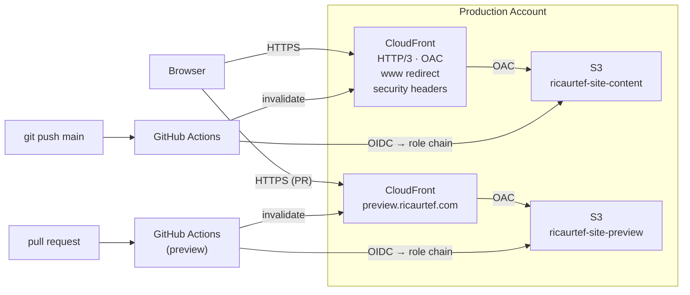

# ricaurtef.com


---

Personal portfolio for [Rubén Ricaurte](https://ricaurtef.com) — platform engineer, cloud
infrastructure builder. This site and the AWS stack behind it were built from scratch as part
of a hands-on learning journey: Terraform modules, OIDC federation, hub-and-spoke IAM, CI/CD
pipelines, and CloudFront delivery. The site is the portfolio; the infrastructure is the proof.

## Architecture



## Repository structure

```
ricaurtef.com/
├── es/
│   └── index.html            # Spanish version
├── img/
│   └── avatar.webp            # Optimized avatar (7.8 KB)
├── .github/workflows/
│   ├── deploy.yml             # S3 sync + CloudFront invalidation (main)
│   └── preview.yml            # Preview deploy + GitHub Deployments API (PR)
├── 404.html                   # Custom error page
├── index.html                 # English version (default)
├── style.css                  # Unified stylesheet with CSS variables
└── theme.js                   # Dark/light toggle + time-based detection
```

## Design

- **Palette:** [Gruvbox](https://github.com/morhetz/gruvbox) Dark (default) + Light via `[data-theme]` CSS variables
- **Theme detection:** sessionStorage > time-based (07–19h = light) > dark fallback
- **Logo:** Powerline-style segments with 6-color pip strip and blinking cursor
- **Hero:** Manga speed lines (conic-gradient), kanji watermark 基盤 (platform/foundation)
- **Typography:** Inter (Google Fonts)
- **404 page:** "Lost in the cloud" with 404 watermark

## Deploy pipeline

Every push to `main` triggers the deploy workflow:

1. **OIDC** — assume hub role in the management account
2. **Role chain** — assume `github-actions-deploy` in the production account
3. **S3 sync** — HTML with 5-minute cache, assets with 1-year immutable cache
4. **CloudFront invalidation** — `/*`

### Preview deploys

Every pull request triggers the preview workflow:

1. Same OIDC + role chain authentication
2. S3 sync to the preview bucket
3. CloudFront invalidation on the preview distribution
4. GitHub Deployments API creates a "View deployment" link in the PR sidebar

Preview content auto-expires after 7 days via S3 lifecycle.

### GitHub variables

| Variable | Description |
|----------|-------------|
| `AWS_ROLE_ARN` | OIDC role in the management account |
| `DEPLOY_ROLE_ARN` | `github-actions-deploy` in the production account |
| `SITE_BUCKET` | S3 bucket name for site content |
| `CF_DISTRIBUTION_ID` | CloudFront distribution ID |
| `PREVIEW_BUCKET` | S3 bucket name for preview content |
| `PREVIEW_CF_DISTRIBUTION_ID` | Preview CloudFront distribution ID |

## Infrastructure

The AWS resources behind this site are managed as code in separate repositories:

- [`aws-cloudfront-site`](https://github.com/ricaurtef/aws-cloudfront-site) — S3, CloudFront, ACM, Route 53, CloudFront Functions, preview environment
- [`aws-account-foundation`](https://github.com/ricaurtef/aws-account-foundation) — AWS Organizations, IAM Identity Center, OIDC federation, hub-and-spoke IAM

## Local preview

Open `index.html` in a browser. Theme toggle and language switching work locally.
